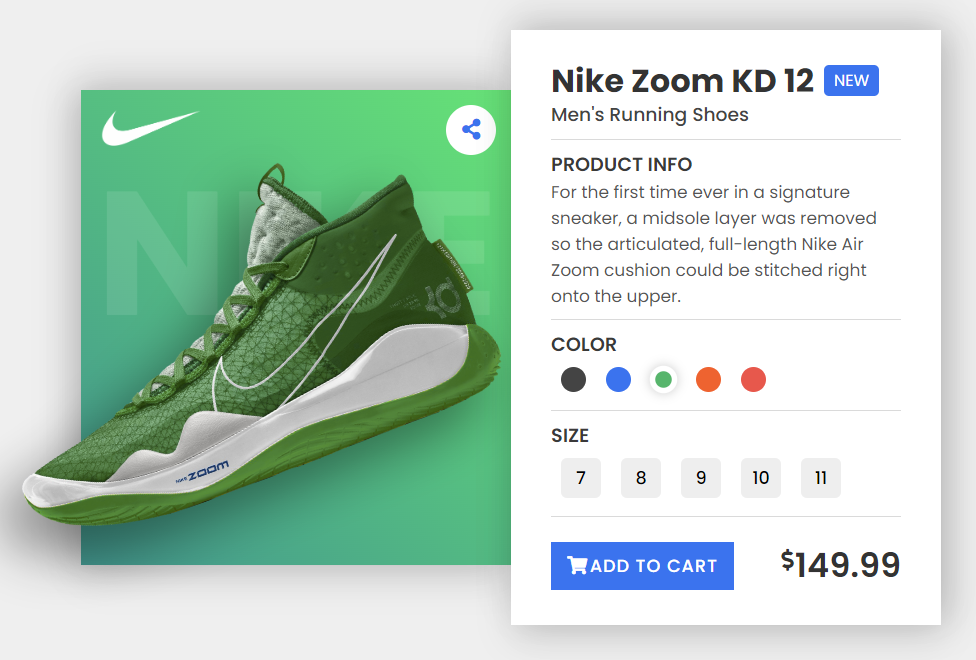
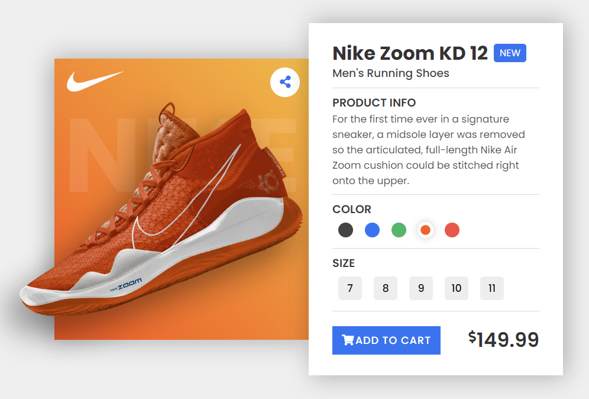
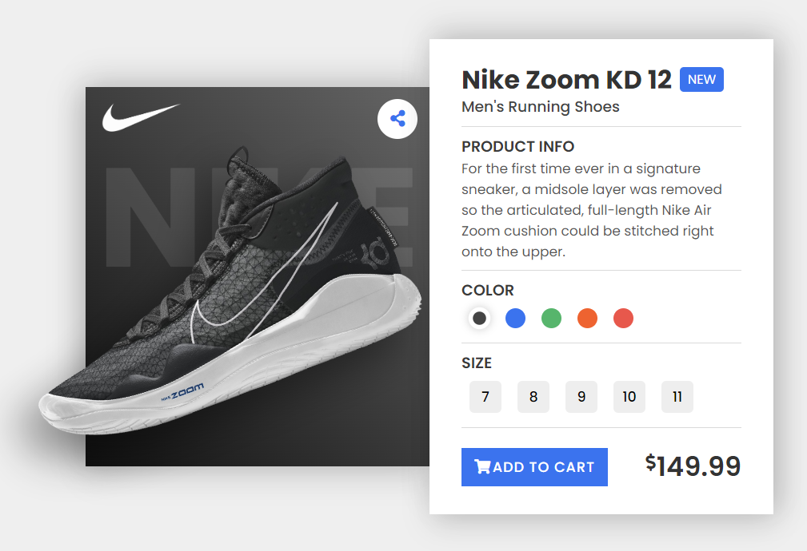

# Javascript Animated Product Card

    

 

    
    
    

This program builds a responsive, animated product card website in HTML, CSS & JavaScript.

This has been built into a website accessible here: https://sommos.github.io/javascript_animated_product_card/

# Contribution 

If you'd like to contribute to `javascript_animated_product_card` please submit a pull-request on a feature branch.

# Installing

Clone the repo:

    git clone https://github.com/Sommos/javascript_animated_product_card
    cd javascript_animated_product_card
